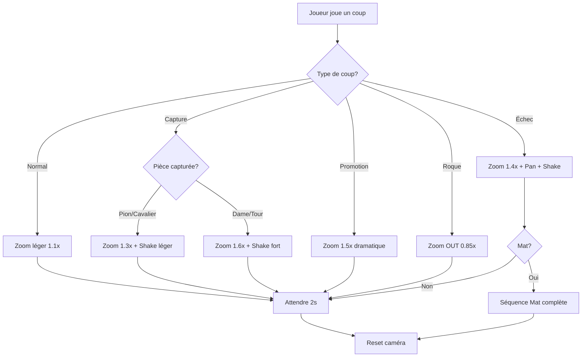

# 🎥 Mouvements de Caméra - Référence Rapide

## 📋 Résumé de l'Analyse

**Vidéo analysée** : `ssstik.io_@chessfxs_1765400769375.mp4`
- ⏱️ Durée : 36.4 secondes
- 📊 Résolution : 576x720
- 🎬 Mouvements détectés : **62 séquences distinctes**

## 📊 Statistiques

| Type | Nombre | % | Durée Moyenne |
|------|--------|---|---------------|
| **ZOOM IN** | 28 | 45% | 0.18s |
| **ZOOM OUT** | 9 | 15% | 0.23s |
| **PAN** | 25 | 40% | 0.30s |

## 🎯 Top 5 Mouvements les Plus Intenses

### 1️⃣ ZOOM IN @ 18.67s
- **Intensité** : 12.56 ⚡⚡⚡⚡⚡
- **Facteur** : 1.628x
- **Usage** : Capture de pièce majeure

### 2️⃣ ZOOM OUT @ 27.40s
- **Intensité** : 14.36 ⚡⚡⚡⚡⚡
- **Facteur** : 0.282x (très large)
- **Usage** : Vue d'ensemble après action

### 3️⃣ ZOOM OUT @ 13.47s
- **Intensité** : 16.30 ⚡⚡⚡⚡⚡
- **Facteur** : 0.824x
- **Usage** : Retour au contexte

### 4️⃣ ZOOM IN @ 30.13s
- **Intensité** : 13.20 ⚡⚡⚡⚡⚡
- **Facteur** : 1.660x
- **Usage** : Moment décisif

### 5️⃣ PAN @ 30.27s
- **Intensité** : 12.35 ⚡⚡⚡⚡
- **Durée** : 0.80s
- **Usage** : Suivre l'action prolongée

## 🔧 Utilisation dans Godot

### Initialisation
```gdscript
@onready var camera = $SubViewport/Camera3D as ChessCameraController
```

### Cas d'Usage

#### 🎯 Coup Normal
```gdscript
camera.dynamic_zoom("normal", target_pos)
# Effet: Zoom léger (1.1x), FOV -3°, retour auto après 2s
```

#### ⚔️ Capture Simple
```gdscript
camera.dynamic_zoom("capture", target_pos)
# Effet: Zoom moyen (1.3x), FOV -8°, shake léger (0.1, 0.3s)
```

#### 👑 Capture Majeure (Dame/Tour)
```gdscript
camera.dynamic_zoom("capture_major", target_pos)
# Effet: Zoom fort (1.6x), FOV -15°, shake fort (0.2, 0.5s)
```

#### ⚠️ Échec
```gdscript
camera.dynamic_zoom("check", king_pos)
# Effet: Zoom (1.4x), FOV -8°, shake (0.15, 0.4s), pan latéral
```

#### 🏆 Échec et Mat
```gdscript
await camera.checkmate_sequence(king_pos)
# Séquence complète:
# 1. Zoom progressif (1.7x) sur le roi
# 2. Shake dramatique (0.25, 0.8s)
# 3. Maintien 1.5s
# 4. Zoom OUT final (0.6x)
```

#### 🎖️ Promotion
```gdscript
camera.dynamic_zoom("promotion", target_pos)
# Effet: Zoom (1.5x), FOV -12°
```

#### 🏰 Roque
```gdscript
camera.dynamic_zoom("castle", target_pos)
# Effet: Zoom OUT (0.85x) pour voir les 2 pièces
```

## 📖 Patterns Détectés

### Pattern "Combo IN + PAN"
Utilisé pour suivre une action importante avec emphase :
```
1. ZOOM IN rapide (0.1-0.3s, facteur 1.2-1.4x)
2. PAN prolongé (0.5-0.8s) pour suivre
3. ZOOM IN final (facteur 1.1-1.3x) pour stabiliser
```

**Quand l'utiliser** : 
- Pièce qui se déplace loin
- Séquence de coups rapide

### Pattern "IN/OUT Rapide"
Crée un effet de "punch" visuel :
```
1. ZOOM IN fort (> 1.3x)
2. Immédiatement ZOOM OUT (< 0.7x)
```

**Quand l'utiliser** :
- Captures importantes
- Moments de surprise

### Pattern "Zoom Progressif"
Construit la tension :
```
1. ZOOM IN lent (0.6-1.0s, facteur 1.1x)
2. Pause (0.2-0.3s)
3. ZOOM IN supplémentaire (facteur 1.2-1.3x)
```

**Quand l'utiliser** :
- Avant un moment critique
- Mise en place d'un mat

## ⚙️ Paramètres Recommandés

### Durées
| Action | Durée | Raison |
|--------|-------|--------|
| Coup normal | 0.5-0.7s | Fluide, pas distrayant |
| Capture | 0.4-0.6s | Rapide, impactant |
| Échec | 0.6-0.8s | Temps de réaction |
| Mat | 1.0-2.0s | Dramatique |

### Facteurs de Zoom
| Événement | Facteur | Distance Résultante |
|-----------|---------|---------------------|
| Normal | 1.1x | ~909 unités |
| Capture | 1.3x | ~769 unités |
| Capture majeure | 1.6x | ~625 unités |
| Échec | 1.4x | ~714 unités |
| Mat | 1.7-1.8x | ~555-588 unités |

### Intensité de Shake
| Niveau | Intensité | Durée | Usage |
|--------|-----------|-------|-------|
| Léger | 0.05-0.10 | 0.2-0.3s | Capture pion |
| Moyen | 0.10-0.20 | 0.3-0.5s | Capture pièce |
| Fort | 0.20-0.30 | 0.5-0.8s | Capture majeure, mat |

## 🎨 Courbes d'Easing

Les animations utilisent automatiquement les courbes suivantes :

```gdscript
# Zoom IN : EASE_OUT (démarrage rapide, fin douce)
eased_progress = ease(progress, -2.0)

# Zoom OUT : EASE_IN (démarrage doux, fin rapide)  
eased_progress = ease(progress, 2.0)

# Pan : LINEAR (mouvement constant)
# Pas d'easing appliqué
```

## 🔄 Workflow Complet



## 📁 Fichiers du Projet

| Fichier | Description |
|---------|-------------|
| [ChessCameraController.gd](file:///home/aurel/ChessGame/src/camera/ChessCameraController.gd) | Script principal |
| [CAMERA_INTEGRATION.md](file:///home/aurel/ChessGame/docs/CAMERA_INTEGRATION.md) | Guide d'intégration |
| [GODOT_CAMERA_GUIDE.md](file:///home/aurel/ChessGame/GODOT_CAMERA_GUIDE.md) | Guide détaillé complet |
| [camera_analysis.json](file:///home/aurel/ChessGame/camera_analysis.json) | Données JSON brutes |
| [analyze_camera.py](file:///home/aurel/ChessGame/analyze_camera.py) | Script d'analyse Python |

## 🚀 Démarrage Rapide

### 1. Attacher le script
```
Scène → Camera3D → Attach Script → ChessCameraController.gd
```

### 2. Dans Board.gd
```gdscript
var camera_controller: ChessCameraController = null

func _ready():
    camera_controller = $"Container/SubViewportContainer/SubViewport/Camera3D"
```

### 3. Dans move_piece()
```gdscript
if camera_controller:
    var target_pos = get_marker_position(end_pos_idx)
    
    if was_capture:
        camera_controller.dynamic_zoom("capture", target_pos)
    else:
        camera_controller.dynamic_zoom("normal", target_pos)
    
    # Reset après 2s
    await get_tree().create_timer(2.0).timeout
    camera_controller.reset_camera()
```

---

✅ **Prêt à l'emploi !** Tous les fichiers sont dans votre projet.

Pour toute question, consultez [CAMERA_INTEGRATION.md](file:///home/aurel/ChessGame/docs/CAMERA_INTEGRATION.md)
